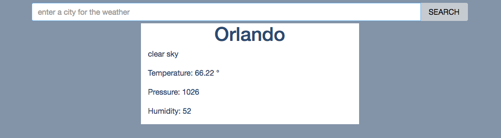

# react-weather-app

A basic weather app that uses the openweathermap.org api and was built with the help of React.js and Redux along with Stephen Grider's React-Redux boilerplate.  




###Getting Started###

There are two methods for getting started with this repo.

####Familiar with Git?#####
Checkout this repo, install dependencies, then start the gulp process with the following:

```
	> git clone git@github.com:StephenGrider/ReduxSimpleStarter.git
	> cd ReduxSimpleStarter
	> npm install
	> npm start
```

####Not Familiar with Git?#####
Click [here](https://github.com/StephenGrider/ReactStarter/releases) then download the .zip file.  Extract the contents of the zip file, then open your terminal, change to the project directory, and:

```
	> npm install
	> npm start
```
